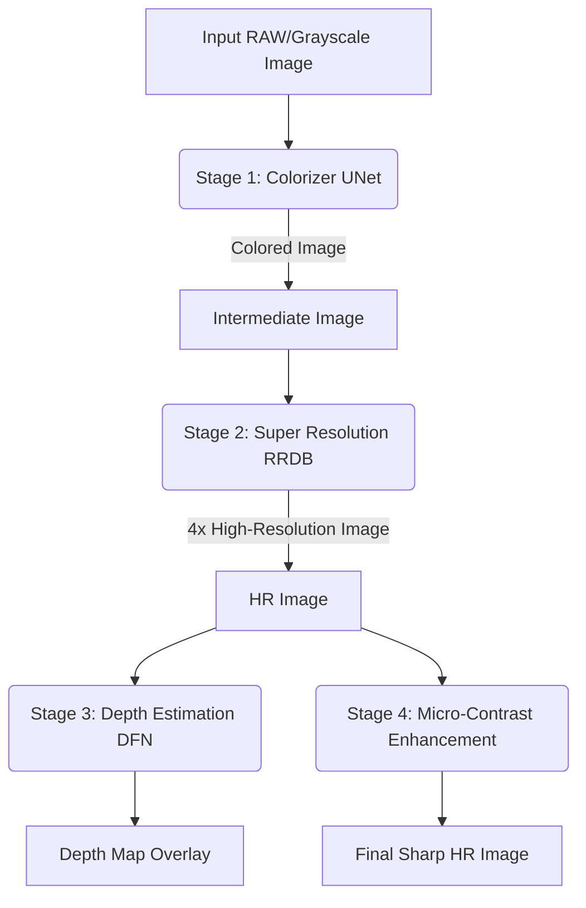

# Colorizer-AI: Architecture & Codebase Context

This document is designed to provide a comprehensive overview of the `colorizer-ai` repository. It serves as a structural map for both human developers and AI coding assistants to quickly understand how the multi-model architecture operates, where logic is stored, and how to execute training.

## 📁 Repository Structure Overview

The project is a **Computational Photography Pipeline** composed of 4 distinct AI models:
1. **Colorizer** (UNet) - Converts grayscale/L-channel to color (AB-channels).
2. **Super Resolution** (RRDB/ESRGAN) - Upscales images by 4x.
3. **Depth Estimation** (DFN) - Predicts a depth map from a 2D image.
4. **Micro-Contrast Enhancement** - Enhances local gradients and sharpness.

The codebase supports two completely interchangeable training paradigms:
- **Unified Config-Driven Pipeline**: One master script (`train.py`) controls all 4 models dynamically using YAML files.
- **Modular Stage Pipeline**: 4 separate, hardcoded Python scripts (`train_colorizer.py`, etc.) control each model individually.

---

## 📄 Dictionary of Files & Directories

### 1. Configurations (`configs/`)
Declares hyperparameters for the Unified Pipeline without needing to edit Python code.
*   **`default.yaml`**: The baseline configuration. Defines global settings like `num_workers`, `accumulate_steps`, `mixed_precision`, and DDP `nccl` backend.
*   **`colorizer.yaml`, `sr.yaml`, `depth.yaml`, `micro_contrast.yaml`**: Model-specific files. They override `default.yaml` with specific learning rates, batch sizes, dataset paths, and loss weights.

### 2. Execution Scripts (`training/`)
*   **`train.py`**: **The Master Unified Script**. Yes, this script CAN train all models. It dynamically reads a YAML config, figures out which exact model architecture, dataset, and loss function to instantiate, and then runs the standardized Distributed Data Parallel (DDP) loop.
*   **`train_colorizer.py`, `train_sr.py`, `train_depth.py`, `train_micro_contrast.py`**: The **Modular Scripts**. These do exactly what `train.py` does, but they are hardcoded for their specific model. They do not rely on YAML configs. If you want to radically change how the Colorizer loop works without risking breaking the SR model, edit `train_colorizer.py`.

### 3. Neural Architectures (`models/`)
Contains the PyTorch `nn.Module` class definitions for the networks.
*   **`unet_colorizer.py`**: U-Net architecture mapping 1 Input Channel (L) to 2 Output Channels (AB).
*   **`rrdb_sr.py`**: Residual-in-Residual Dense Block architecture for 4x Upscaling.
*   **`depth_model.py`**: Dynamic Filter Network for depth extraction.
*   **`micro_contrast_model.py`**: Convolutional network for Laplacian gradient boosting.

### 4. Data Pipelines (`datasets/`)
Contains the PyTorch `Dataset` structures and pre-computation scripts.
*   **`preprocess_lab.py`**: A vital speed-up script. Pre-converts a massive folder of RGB images into fast-loading `.npy` arrays split into `L/` and `AB/` directories. Run this *before* training the Colorizer.
*   **`dataset_loader.py`**: The unified dataset loader framework.
*   **`dataset_colorizer.py`, `dataset_sr.py`, `dataset_depth.py`**: The modular, stage-specific dataset definitions containing `__getitem__` logic directly mapping inputs to targets (e.g. taking an HR image, applying `RandomCrop(256)`, and applying a bicubic downscale to generate the LR pairing).

### 5. Shared Logic (`utils/`)
*   **`config_loader.py`**: Contains `merge_configs()`. Gracefully combines `default.yaml` with your target `colorizer.yaml` so you never have redundant variables.
*   **`losses.py`**: Defines custom mathematical objectives like `HybridColorizationLoss` (which intelligently balances L1, VGG Perceptual relu2_2 features, and SSIM structural similarity).
*   **`tracker.py`**: The `ModelTracker` class. Handles everything regarding saving `best_metric` `.pth` checkpoints, automatically resuming runs, and plotting PSNR, SSIM, and LPIPS charts directly to TensorBoard.

### 6. Shell Launchers (Root Directory)
Since `DataDistributedParallel` (DDP) requires careful environment orchestration across multi-GPU nodes, do not run python directly. Use these wrappers:
*   **`run_training.sh`**: Triggers the Unified Pipeline. 
    * *Example:* `./run_training.sh configs/sr.yaml`
*   **`run_stage.sh`**: Triggers the Modular Pipeline. 
    * *Example:* `./run_stage.sh sr`
*   **`SETUP.md`**: Guide for installing NVIDIA CUDA dependencies and PyTorch when migrating to a fresh Linux server.

---

## 🚀 Training Pipeline Explained

The training pipeline is designed to be highly scalable and is powered by PyTorch **DistributedDataParallel (DDP)** and **Automatic Mixed Precision (AMP)** to maximize hardware utilization:

1. **Initialization:** The `torchrun` elastic orchestrator provisions the `RANK` and `WORLD_SIZE` environment variables and spawns synchronized Python processes across all available GPUs.
2. **Environment Setup:** The active script initializes the NCCL process group, sets the specific `cuda:X` device ID for the current rank, and natively enables NVIDIA `cudnn.benchmark` and `tf32` math optimizations for massive convolution speedups.
3. **Data Loading:** A `DistributedSampler` ensures that each GPU gets a unique, non-overlapping subset of the dataset. The DataLoader is fully optimized with dynamic `num_workers` bound to the CPU count and `pin_memory=True`.
4. **Forward & Backward Pass:**
   * The PyTorch node is wrapped safely in `DDP()`.
   * Inputs traverse the model within an `autocast` context block.
   * Gradients are accumulated over mathematical `accumulate_steps` loops using `model.no_sync()` to entirely prevent unnecessary cross-GPU network communication during partial steps.
5. **Optimization:** Once the accumulation window fills, the `GradScaler` unscales gradients, applies normalized gradient clipping to prevent explosion, mathematically steps the optimizer once, and zeroes the momentum.
6. **Logging & Checkpointing:** During evaluation loops, metrics like PSNR, SSIM, and LPIPS are aggregated across all GPUs natively via `dist.all_reduce()`. **Only Rank 0** physically writes the logs to TensorBoard and safely generates `.pth` checkpoints to prevent node locking.

---

## 🖼️ Inference Pipeline Architecture

During runtime inference, the models are sequentially chained to form the final Computational Photography Pipeline.



*Note: The training checkpoints intentionally strip the `module.` prefix so that they seamlessly load onto a cheap, single-GPU or CPU inference server without any code changes.*

---

## 📚 Dataset Structure

The staging folder natively expects datasets partitioned by model. Your filesystem must mimic this exactly for the loaders to find your configurations:

```text
data/
├── colorization/
│   ├── rgb_images/       # Raw untouched RGB images
│   └── preprocessed_lab/ # Generated by preprocess_lab.py
│       ├── L/            # Fast-loading .npy Lightness arrays
│       └── AB/           # Fast-loading .npy Color arrays
├── sr/
│   └── train/            # High-resolution ground truth (e.g. DIV2K/Flickr2K)
├── depth/
│   └── train/            # Base RGB paired with physical Depth Maps
└── enhance/
    └── train/            # Base RGB paired with Laplacian-enhanced targets
```

---

## 🖥️ Hardware & System Requirements

To effectively train and execute this clustered pipeline without I/O bottle-necking, the following hardware is strongly mapped:

*   **GPU Topology:** NVIDIA GPUs. Ampere/Ada/Hopper architectures are highly preferred due to native hardware-accelerated **TF32** support. For DDP, an 8-GPU node (e.g., 8x RTX A6000, A100, or H100) is standard.
*   **VRAM Limits:** Minimum **16GB** per GPU when relying heavily on mixed-precision AMP. **24GB+** is highly recommended for pushing large batch sizes or rendering 512x512 High-Resolution spatial crops inside `dataset_loader.py`.
*   **Disk Storage:** Fast **NVMe SSD arrays** are completely critical. Spindle hard drives will painfully bottleneck DataLoader workers when parsing `.npy` caches and hundreds of thousands of HR image nodes.
*   **Platform Dependencies:** Linux OS (Ubuntu 20.04/22.04+ natively supported), CUDA Toolkit 11.8+, Python 3.9+, and PyTorch 2.0+.

---

## 🧠 Note for AI Assistants
When asked to modify the training flow, verify with the user if they prefer to modify the **Unified** (`train.py` + `yaml`) or **Modular** (`train_[stage].py`) ecosystem. 

- If optimizing general Multi-GPU logic, Gradient Accumulation, or Mixed Precision AMP: edit the central loops.
- If modifying hyper-parameters: **do not edit Python**, strictly edit the `configs/*.yaml` files.
- DDP logic correctly uses `model.no_sync()` during accumulation, and checkpoints explicitly strip the `module.` prefix so the resulting `.pth` files can be loaded natively into a CPU/Single-GPU inference wrapper.
